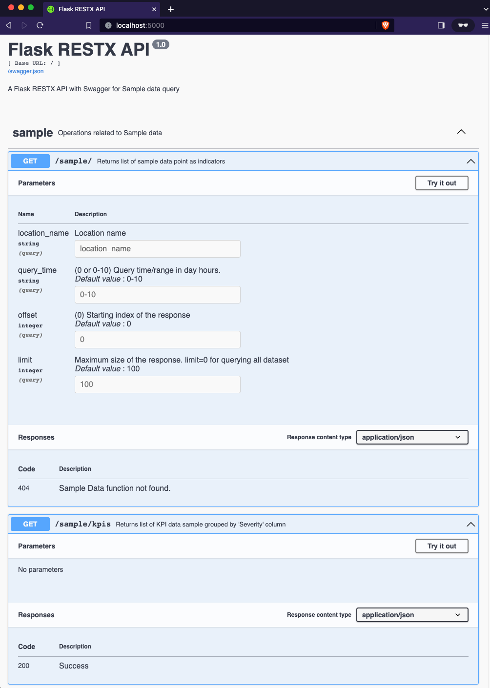

# RESTX-Swagger Application
Swagger enabled Flask RESTX web services template project

#### A. Environment Setup
- [Miniconda3](https://docs.conda.io/projects/conda/en/latest/user-guide/install/linux.html) Windows/Server [Environment](https://docs.conda.io/projects/conda/en/latest/user-guide/tasks/manage-environments.html)
    ```
    conda env remove -n restx
    conda env create -n restx --file environment.yml --force
    conda activate restx
    ```

#### B. Server 

- *Environment & Launch*
    ```
    $ export $(xargs < .envrc) # Use this to configure the Application/AWS credentials
    $ cd src/rest
    $ flask run --host=0.0.0.0 --port=5000
    ```
- App Instance
    - REST API: http://localhost:5000


#### C. Test 
- *Pytest-Flask in [src/tests](./src)*
    ```
    $ cd src/rest
    $ pytest
    ```
#### D. Datasource 

- **Data** : ./data/data_samples.csv

#### E. Service URLs

Check the [Flask-RESTPlus & SwaggerUI](https://flask-restplus.readthedocs.io/en/stable/) documentation for more details

- Swagger Descriptor (http://localhost:5000/swagger.json)

| No | HTTP   | Parameters                               | REST Web Service Interface                                                |
|:---| :------|:-----------------------------------------| :------------------------------------------------------------------------ |
| 1  | GET    | query_time                               | 'http://localhost:5000/sample/?query_time=0-10&offset=0&limit=100'        |
| 2  | GET    |                                          | 'http://localhost:5000/sample/kpis'                                       |

These datasets can be consumed by [Highcharts](https://www.highcharts.com/demo) or any other application. 

> Swagger UI

[](./data/swagger-screenshot.png?raw=true "Swagger UI")